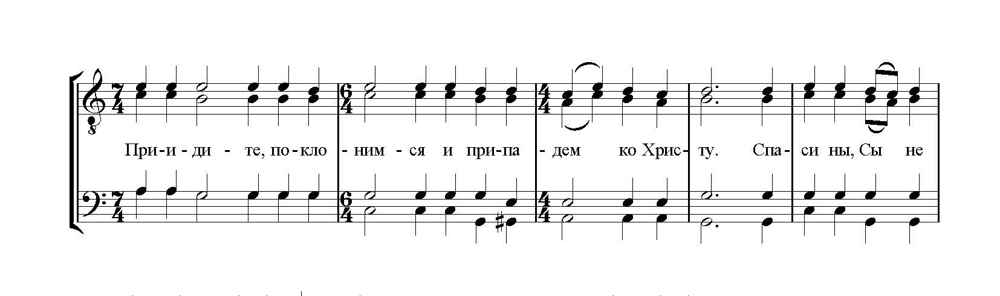
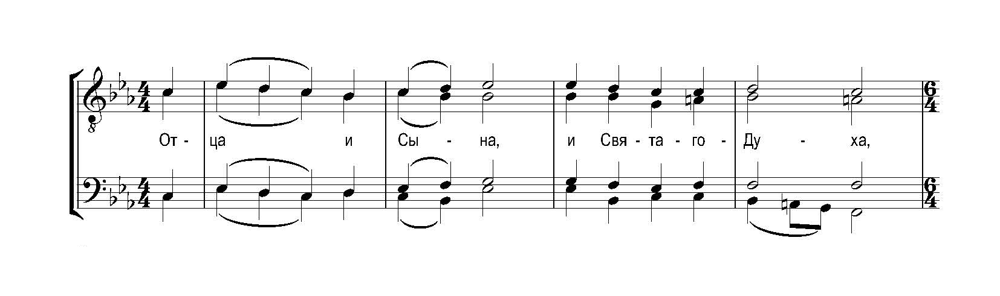
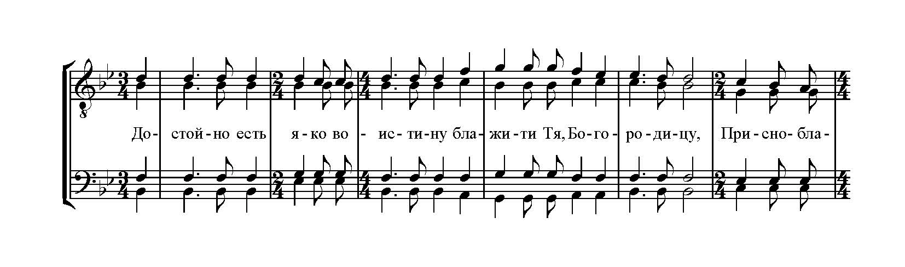
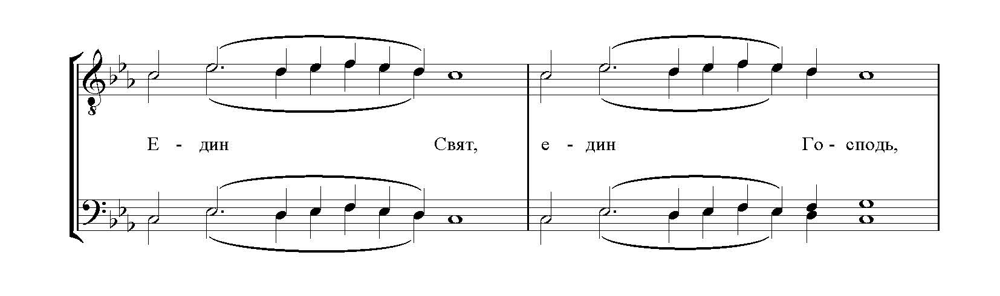
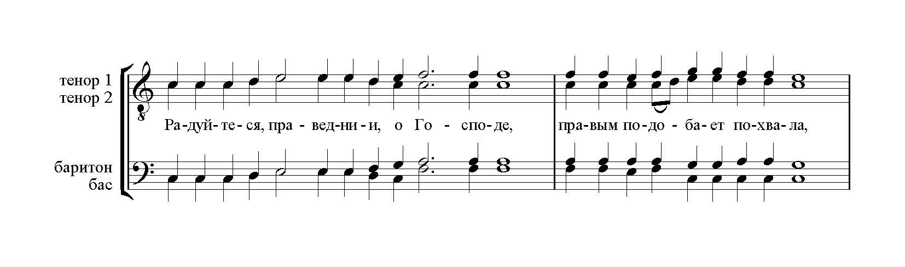
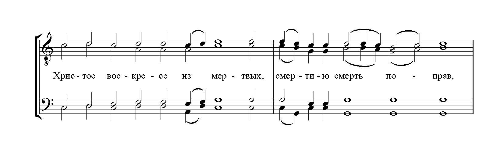
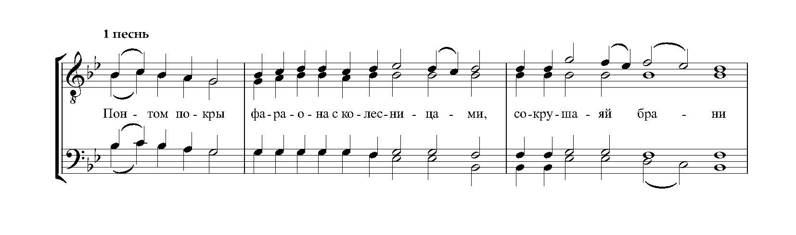

# Ноты для мужского хора

## Литургия

-   ### Приидите, поклонимся

    ---

    

    **Состав хора**: четырёхголосие
    
    **Тональность**: a-moll

    **Комментарий**: Входный стих

    [Скачать ноты](../scores/male/приидите_поклонимся_гафаров.pdf){target=_blank}

-   ### Отца и Сына

    ---

    

    **Состав хора**: четырёхголосие
    
    **Тональность**: c-moll / Bb-dur

    [Скачать ноты](../scores/male/отца_и_сына_гафаров.pdf){target=_blank}

-   ### Достойно есть

    ---

    

    **Состав хора**: четырёхголосие
    
    **Тональность**: Bb-dur

    [Скачать ноты](../scores/male/достойно_есть_муж_гафаров.pdf){target=_blank}

-   ### Един Свят

    ---

    

    **Состав хора**: четырёхголосие
    
    **Тональность**: c-moll

    **Комментарий**: гармонизация распева

    [Скачать ноты](../scores/male/един_свят_гафаров.pdf){target=_blank}

-   ### Радуйтеся праведнии

    ---

    

    **Состав хора**: четырёхголосие
    
    **Тональность**: C-dur

    **Комментарий**: Причастный стих

    [Скачать ноты](../scores/male/радуйтеся_праведнии_гафаров.pdf){target=_blank}

## Праздники

-   ### Тропарь Пасхи

    ---

    

    **Праздник**: Пасха
    
    **Состав хора**: четырёхголосие
    
    **Тональность**: C-dur

    **Комментарий**: Гармонизация знаменного распева

    [Скачать ноты](../scores/male/тропарь_пасхи_гафаров.pdf){target=_blank}

-   ### Ирмосы первого канона Троицы

    ---

    

    **Праздник**: Троица
    
    **Состав хора**: четырёхголосие
    
    **Тональность**: g-moll

    **Комментарий**: Гармонизация знаменного распева

    [Скачать ноты](../scores/male/1_канон_троицы_гафаров.pdf){target=_blank}

