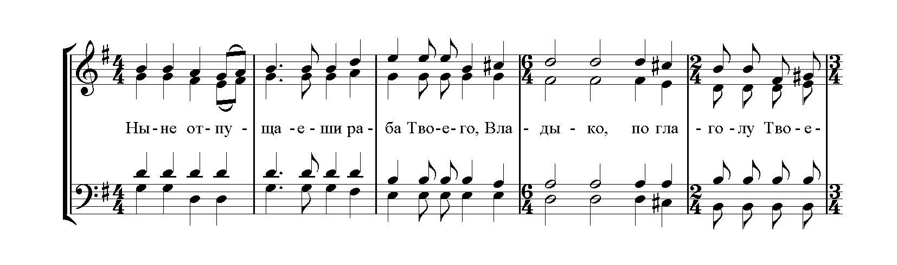

# Ноты для смешанного хора

## Всенощное бдение

-   ### Ныне отпущаеши

    ---

    

    **Состав хора**: четырёхголосие
    
    **Тональность**: G-dur 

    **Служба**: вечерня

    [Скачать ноты](../scores/mixed/ныне_отпущаеши_гафаров.pdf){target=_blank}

-   ### Преблагословенна еси

    ---

    

    **Состав хора**: четырёхголосие
    
    **Тональность**: f-moll 

    **Служба**: утреня

    [Скачать ноты](../scores/mixed/преблагословенна_еси_гафаров.pdf){target=_blank}

-   ### Окончание утрени

    ---

    

    **Состав хора**: четырёхголосие
    
    **Тональность**: g-moll 

    **Служба**: утреня

    **Комментарий**: просительная ектения, утверди, Боже, Честнейшую, многолетие

    [Скачать ноты](../scores/mixed/окончание_утрени_гафаров.pdf){target=_blank}

## Литургия

-   ### Во царствии Твоем

    ---

    

    **Состав хора**: четырёхголосие
    
    **Тональность**: g-moll

    **Комментарий**: третий изобразительный антифон

    [Скачать ноты](../scores/mixed/во_царствии_твоем_гафаров.pdf){target=_blank}

-   ### Приидите, поклонимся

    ---

    

    **Состав хора**: четырёхголосие
    
    **Тональность**: e-moll

    **Комментарий**: Входный стих

    [Скачать ноты](../scores/mixed/приидите_гафаров.pdf){target=_blank}

-   ### Трисвятое кегостровское

    ---

    

    **Состав хора**: четырёхголосие
    
    **Тональность**: F-dur

    [Скачать ноты](../scores/mixed/трисвятое_кегостровское_гафаров.pdf){target=_blank}

-   ### Елицы во Христа

    ---

    

    **Состав хора**: шестиголосие
    
    **Тональность**: G-dur

    [Скачать ноты](../scores/mixed/елицы_гафаров.pdf){target=_blank}

-   ### Милость мира

    ---

    

    **Состав хора**: шестиголосие
    
    **Тональность**: e-moll

    [Скачать ноты](../scores/mixed/милость_мира_гафаров.pdf){target=_blank}

-   ### Достойно есть

    ---

    

    **Состав хора**: четырехголосие
    
    **Тональность**: F-dur

    [Скачать ноты](../scores/mixed/достойно_есть_гафаров.pdf){target=_blank}

## Прокимены на Литургии

-   ### Прокимен Богоявления

    ---

    

    **Состав хора**: четырёхголосие
    
    **Тональность**: F-dur

    **Глас**: 4 глас

    [Скачать ноты](../scores/mixed/прокимен_богоявления_гафаров.pdf){target=_blank}

-   ### Прокимен Благовещения

    ---

    

    **Состав хора**: четырёхголосие
    
    **Тональность**: g-moll

    **Глас**: 4 глас

    [Скачать ноты](../scores/mixed/прокимен_благовещения_гафаров.pdf){target=_blank}

-   ### Прокимен Святым («Честна пред Господем»)

    ---

    

    **Состав хора**: четырёхголосие
    
    **Тональность**: F-dur

    **Глас**: 7 глас

    [Скачать ноты](../scores/mixed/прокимен_святым_гафаров.pdf){target=_blank}

## Ектении

-   ### Великая ектения

    ---

    
    
    **Состав хора**: четырёхголосие
    
    **Тональность**: g-moll

    [Скачать ноты](../scores/mixed/великая_ектения_гафаров.pdf){target=_blank}

-   ### Сугубая ектения Кегостровская

    ---

    
    
    **Состав хора**: четырёхголосие
    
    **Тональность**: a-moll

    [Скачать ноты](../scores/mixed/сугубая_ектения_кегостровская_гафаров.pdf){target=_blank}

## Праздники

-   ### Тропарь Рождества Христова

    ---

    

    **Праздник**: Рождество Христово
    
    **Состав хора**: четырёхголосие
    
    **Тональность**: Es-dur

    [Скачать ноты](../scores/mixed/тропарь_рождества_христова_гафаров.pdf){target=_blank}

-   ### Величание на Рождество Христово

    ---

    

    **Праздник**: Рождество Христово
    
    **Состав хора**: четырёхголосие
    
    **Тональность**: d-moll / g-moll

    **Комментарий**: Гармонизация знаменного распева

    [Скачать ноты](../scores/mixed/величание_рождество_христово_гафаров.pdf){target=_blank}

## Требы

-   ### Вечная память

    ---

    

    **Треба**: Панихида, Отпевание
    
    **Состав хора**: четырёхголосие
    
    **Тональность**: F-dur

    **Комментарий**: Гармонизация знаменного распева

    [Скачать ноты](../scores/mixed/вечная_память_гафаров.pdf){target=_blank}

