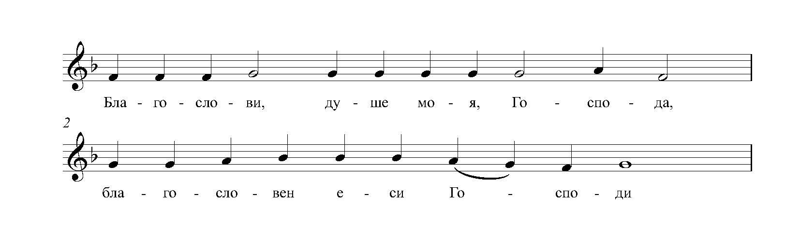
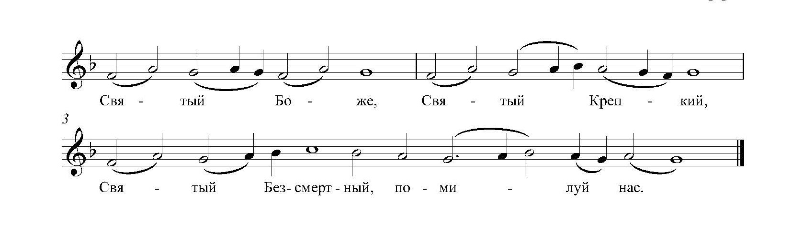

# Одноголосие

-   ### Антифоны изобразительные

    ---

    
    
    **Тональность**: g-moll

    [Скачать ноты](../scores/solo/изобразительные_антифоны_гафаров.pdf){target=_blank}

-   ### Трисвятое

    ---

    
    
    **Тональность**: F-dur

    [Скачать ноты](../scores/solo/трисвятое_гафаров.pdf){target=_blank}

