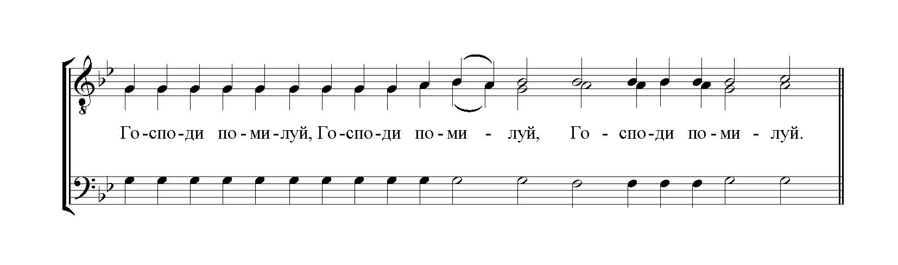
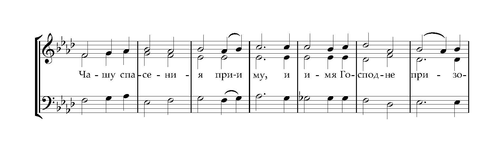
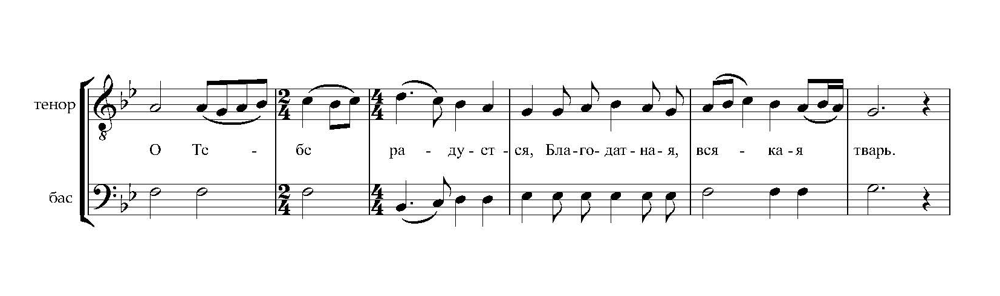
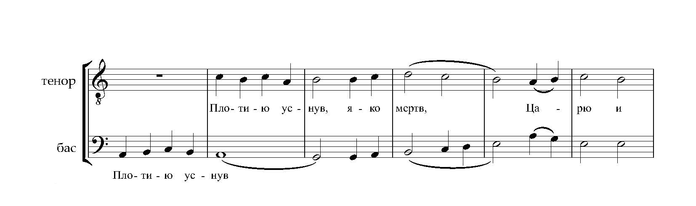
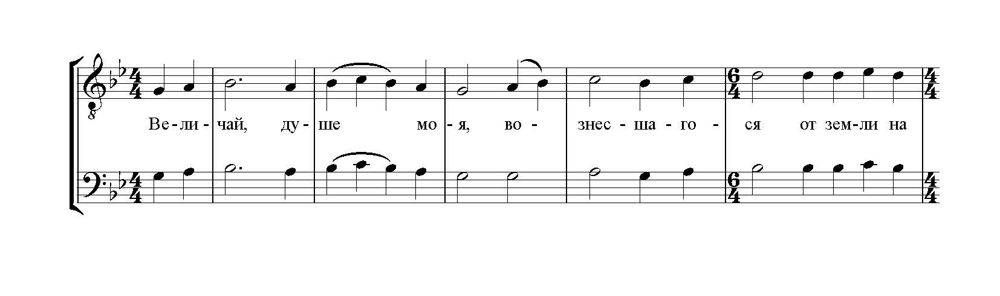

# Трио, дуэты

-   ### Ектения сугубая

    ---

    
    
    **Состав хора**: мужское трио (можно исполнять женским трио)
    
    **Тональность**: g-moll

    [Скачать ноты](scores/trio/ектения_сугубая_трио_гафаров.pdf){target=_blank}

-   ### Чашу спасения

    ---

    
    
    **Состав хора**: смешанное трио (сопрано, альт, баритон)
    
    **Тональность**: As-dur

    **Комментарий**: причастный стих в среду и Богородичные праздники

    [Скачать ноты](scores/trio/чашу_спасения_гафаров.pdf){target=_blank}

-   ### О Тебе радуется

    ---

    
    
    **Состав хора**: дуэт
    
    **Тональность**: Bb-dur

    [Скачать ноты](scores/trio/о_тебе_радуется_гафаров.pdf){target=_blank}

-   ### Эксапостиларий Пасхи

    ---

    
    
    **Состав хора**: дуэт
    
    **Тональность**: a-moll

    [Скачать ноты](scores/trio/эксапостиларий_пасхи_гафаров.pdf){target=_blank}

-   ### Задостойник Вознесения Господня

    ---

    
    
    **Состав хора**: дуэт
    
    **Тональность**: g-moll

    [Скачать ноты](scores/trio/задостойник_вознесения_гафаров.pdf){target=_blank}

